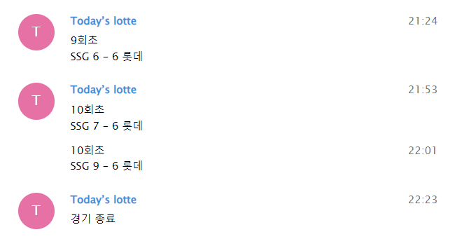

(수정 필요)
>## **오늘의 야구, 실시간 업데이트**

비교적 긴 경기 시간으로 인해 전체 이닝을 시청하기 어려운 팬들을 위해 개발된 프로젝트입니다.   
실시간 경기 시청이 어려운 팬들에게 중요한 순간을 놓치지 않도록 득점 변동 사항을 즉각 알려주고,  
경기 시작 1시간 전과 30분 전에는 경기 및 라인업 정보를 발송하여 원활한 시청을 유도합니다.

.  
>### Features

- 응원팀의 월간 경기 스케줄 및 일일 경기 정보 크롤링 
- 경기 시작 1시간 전, 30분 전 경기 및 라인업 정보 발송
- 득점 시, 변동 사항 실시간 발송 (예시 : '롯데 3 - 2 NC' ) 
- 텔레그램 메시지 API를 활용한 알림 기능 (카카오톡 서비스 - 검토 필요)
- supplements : 메세지 창에서 야구 뉴스 / 국내 뉴스 검색 가능

.   
>supplements 

- **네이버 야구 뉴스 크롤링** 
    - command
        1. news             -> 최근 응원팀 뉴스 5개 
        2. news {n}         -> 최근 응원팀 뉴스 n개 
        3. news {keyword}   -> keyword를 포함한 응원팀 뉴스 최대 10개
        - (제목, url -> 요청 1회 시 메시지 1개)
        - 응원팀 변경 가능  

- **국내 뉴스 크롤링**
    - command
        1. news             -> 최근 뉴스 5개 
        2. news {n}         -> 최근 뉴스 n개 
        3. news {keyword}   -> keyword를 포함한 뉴스 최대 10개  
        - (제목, 요약, url -> 요청 1회 시 메시지 1개) 
        - 언론사 변경 가능   
.        
.  
>### more
- 라인업 메시지 발송 예시  
  
.  
- 득점시 메시지 발송 예시    
    
.    
- 야구 뉴스 요청 시 메시지 발송 예시      
  
  
  

>### Contact
오류가 있거나 의견 교환이 필요하신 분은 ( )로 연락 바랍니다!